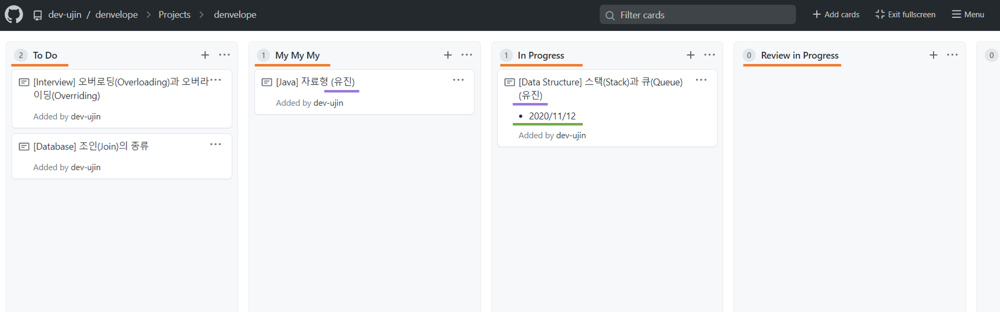

*2020-11-12 written by dev-ujin*
- :mailbox_with_mail:[소개](#mailbox_with_mail-소개)
- :mailbox_with_mail:[진행 방식](#mailbox_with_mail-진행-방식)
  - :page_facing_up:[문서 새로 작성](page_facing_up-문서-새로-작성)
  - :construction:[명명 규칙](#construction-명명-규칙)
    - [문서명](#문서명)
    - [문서 본문](#문서-본문)
    - [커밋 메시지](#커밋-메시지commit-message)
- :mailbox_with_mail:[참고사항](#mailbox_with_mail-참고사항)

# :envelope_with_arrow: DENVELOPE :envelope_with_arrow:
## :mailbox_with_mail: 소개
Denvelope(덴벨롭)은 개발에 필요한 공부를 하며 채워나가는 **개발대백과** 프로젝트이다.

## :mailbox_with_mail: 진행 방식
### :page_facing_up: 문서 새로 작성

1. 프로젝트 보드를 확인한다.
   - `To Do` : 다루어졌으면 좋겠는 주제
   - `My My My` : 이후에 작성할 주제(찜하기)
   - `In Progress` : 작성 중인 주제
   - `Review in Progress` : 작성을 마치고 Master브랜치에 pull request가 요청된 주제
   - `Done` : 작성을 완료한 주제(Master가 담당)
2. 원하는 주제를 골라 `In Progress`로 옮기고 자신의 **이름**과 작성을 시작한 **날짜**를 적어 노트를 수정한다.
3. Master branch에서 `pull`을 하여 최신 상태의 코드를 내려 받는다.
4. Branch를 생성해 작업을 시작하고 작업을 마친후 `pull request`한다.
5. 프로젝트 보드에서 해당 주제를 `Review in Progress` 보드로 옮긴다.


### :construction: 명명 규칙
#### 문서명
```
// 형식
[카테고리] 제목

// 예시
[OS] 선점 스케줄링(Preemptive Scheduling)
[Database]
``` 

#### 문서 본문
- **날짜**와 **이름**, **제목**, **목차**(TOC, Table of Contents)를 작성한다.
- **본문**을 작성한다.
- 참고한 자료가 있다면 **출처**를 남긴다.
```
//예시
*2020-11-12 written by dev-ujin*
# 제목
목차
...
본문
...
참고자료
```

#### 커밋 메시지(Commit Message)
- Type : `Add` / `Update` / `Delete`

```
// 형식
[Type] YYYY-MM-DD [카테고리] 제목

//예시
[Add] 2020-11-12 [database] key의 종류
```
### :mailbox_with_mail: 참고사항
- :pushpin:개선점을 제안하거나, 도움이 필요하거나, 논의거리가 생겼을 땐 `issue` 를 생성한다.
- :pushpin:적절한 카테고리가 없으면 새로 생성한다.
